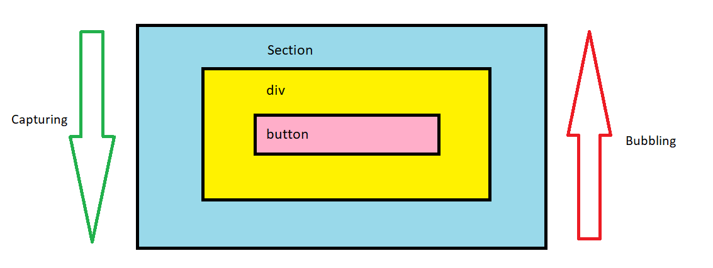

# More on Events

- Events in Brower side Javascript has two phases one is capturing and other is bubbling.
- The browser runs through these two phases to get all the listeners for the event.First it runs through capturing phase and then through bubbling phase.
- In capturing phase event traverse from outer element(parent) to inner element(child).
- In bubbling phase event traverse from inner element(child) to outer element(parent).



- By Default , All event listeners that are added using addEventListener() are registered in bubbling phase. 

```html
<!DOCTYPE html>
<html lang="en">
<head>
    <meta charset="UTF-8">
    <meta http-equiv="X-UA-Compatible" content="IE=edge">
    <meta name="viewport" content="width=device-width, initial-scale=1.0">
    <title>Document</title>
    <script src="app.js" defer></script>
</head>
<body>
   <section>
    <div>
        <button> Click Me</button>
    </div>
   </section> 
</body>
</html>
```
we will refer above html through out the example.

```js
let section = document.querySelector('section');
let div = document.querySelector('div');
let btn = document.querySelector('button');

section.addEventListener('click',()=>{
        console.log('Section is clicked');
    });

div.addEventListener('click',()=>{
        console.log('Div is clicked')
    });

btn.addEventListener('click',()=>{
        console.log('Button is clicked');
    });
/* on clicking the button the console statements will be printed as:
Button is clicked 
Div is clicked 
Section is clicked 
*/
```

> What if we want to register the eventListener in capturing phase?

- the syntax of method addEventListener :  _addEventListener(type, listener, useCapture)_
  
- By default the third parameter useCapture is false.

- To register addEventListener in capturing phase make third argument to the addEventListener function as true.
  
 ```js
 let section = document.querySelector('section');
    let div = document.querySelector('div');
    let btn = document.querySelector('button');

    section.addEventListener('click',()=>{
        console.log('Section is clicked');
    });

    div.addEventListener('click',()=>{
        console.log('Div is clicked')
    });

    btn.addEventListener('click',()=>{
        console.log('Button is clicked');
    },true);   // pass true to useCapture

    /*
    on button click, the console statements are printed as:
    Button is clicked 
    Div is clicked 
    Section is clicked
    */
 ``` 

 [What is Event Propagation and how to stop propagating an event?](./Event_Propagation.md)